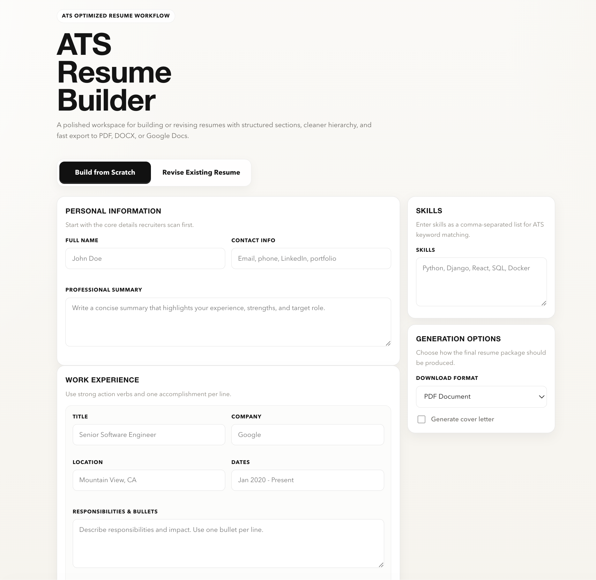
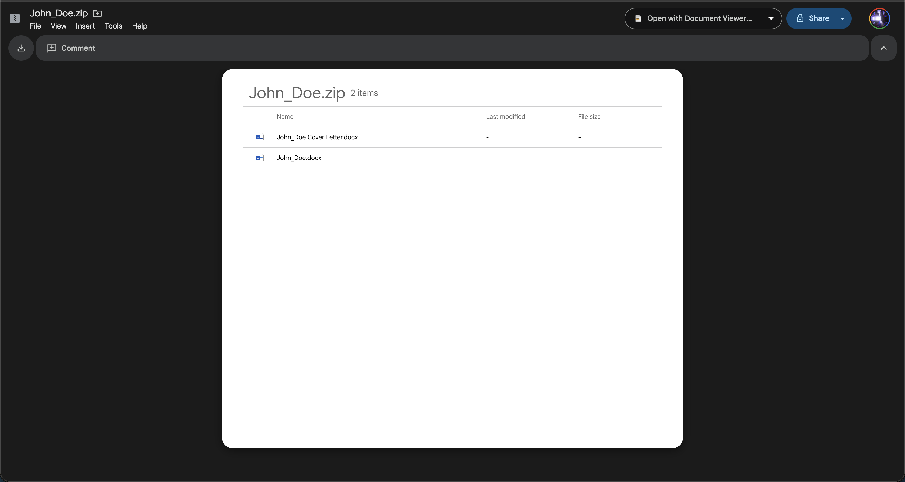
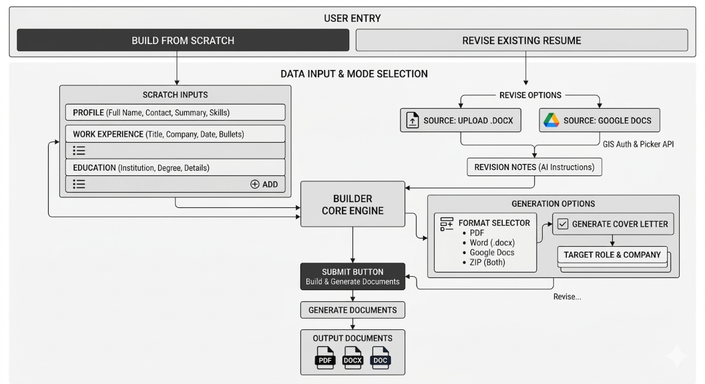

# Resume & Cover Letter Generator with Gemini AI

A Python application that generates and revises ATS-optimized resumes and tailored cover letters using Google's Gemini AI (`gemini-3.1-pro-preview`). Available as both a **CLI tool** and an interactive **Web UI** built with Django.



## Features

- **Resume Generation** — Enter your professional facts and let Gemini craft an ATS-friendly resume using the Google XYZ formula: *"Accomplished [X] as measured by [Y], by doing [Z]."*
- **Cover Letter Generation** — Optionally generate a role-specific cover letter tailored to a target company and position.
- **Resume Revision** — Feed an existing `.docx` or **Google Doc** with revision notes and let Gemini rewrite and improve it. Supports natural language instructions such as reordering jobs, rewriting the summary, or changing details.
- **Google Drive Integration** — Pick any Google Doc from your Drive directly in the browser via the **Google Picker API**, powered by Google Identity Services (GIS) and FedCM-compatible OAuth 2.0.
- **Multiple Output Formats** — Export to `.pdf`, `.docx`, both simultaneously, or directly to **Google Docs** via the Google Drive API.
- **Dry-Run Mode** — Preview the generated JSON output without writing any files.
- **Revision Diff Summary** — See a structured log of exactly what changed between resume versions.
- **Web UI** — A Django-powered browser interface supporting form-based generation, file uploads, and Google Drive file selection.
- **Pydantic Schema Validation** — Every Gemini response is validated against strict Pydantic v2 models before any file is written.
- **Structured Logging** — All errors and status messages use Python's standard `logging` module for easy redirection.

## Project Structure

```
resume-gen/
├── main.py              # Core CLI entrypoint and generation logic
├── prompts.py           # System prompt definitions (Resume, Revision, Cover Letter)
├── manage.py            # Django management entrypoint
├── requirements.txt
├── client_secret.json   # Google OAuth credentials (gitignored)
├── .env                 # Environment variables — GEMINI_API_KEY, GOOGLE_CLOUD_API_KEY
├── .env.keys            # dotenvx encryption keys (gitignored)
├── resume_web/          # Django project configuration
│   ├── settings.py
│   ├── urls.py
│   └── wsgi.py
├── builder/             # Django app — Web UI
│   ├── views.py
│   ├── utils.py         # Bridge between Django and core main.py logic
│   ├── urls.py
│   ├── apps.py
│   └── templates/
│       └── builder/
│           └── index.html
├── static/              # Static assets (CSS, JS, images)
├── examples/            # Sample output files for reference
└── resumes/             # Default output directory for generated files
```

## Prerequisites

- Python 3.9+
- A Google Gemini API Key
- A Google Cloud project with the **Google Drive API** and **Google Picker API** enabled
- OAuth 2.0 credentials (`client_secret.json`) from [Google Cloud Console](https://console.cloud.google.com/)
  - **Web UI**: Create a **Web Application** OAuth client. Add `http://127.0.0.1:8000` as an authorized JavaScript origin and `http://127.0.0.1:8000/google-callback/` as an authorized redirect URI.
  - **CLI `--format gdocs`**: Uses `InstalledAppFlow` — create a **Web Application** OAuth client and add `http://localhost` as an authorized redirect URI, or reuse the same Web Application client as the Web UI.

## Installation

1. Clone the repository:

```bash
git clone https://github.com/Misterscan/resume-gen.git
cd resume-gen
```

2. Create and activate a virtual environment:

```bash
python3 -m venv venv
source venv/bin/activate  # Windows: venv\Scripts\activate
```

3. Install dependencies:

```bash
pip install -r requirements.txt
```

4. Set your Gemini API key:

```bash
export GEMINI_API_KEY="your-api-key-here"
```

> You can also use a `.env` file. The project supports `dotenvx` for encrypted `.env` management.

5. Set up Google credentials by creating a `client_secret.json` file in the project root.

   The app reads two values from this file:
   - **`client_id`** — your OAuth 2.0 client ID (used for Google Drive login and the Picker)
   - **`api_key`** — your Google Cloud API key (used to load the Picker API in the browser)

   To get these, go to [Google Cloud Console](https://console.cloud.google.com/) and enable the **Google Drive API** and **Google Picker API** on your project. Then:

   - Under **APIs & Services → Credentials**, create a **Web Application** OAuth 2.0 client. Add `http://127.0.0.1:8000` as an authorized JavaScript origin and `http://127.0.0.1:8000/google-callback/` as an authorized redirect URI. Download the JSON and save it as `client_secret.json`.
   - Also create an **API key** and add `api_key` as a field inside the `web` object in `client_secret.json`:

   ```json
   {
     "web": {
       "client_id": "YOUR_CLIENT_ID.apps.googleusercontent.com",
       "client_secret": "YOUR_CLIENT_SECRET",
       "api_key": "YOUR_API_KEY",
       ...
     }
   }
   ```

   Alternatively, set the API key as an environment variable instead of embedding it in the JSON:

   ```bash
   export GOOGLE_CLOUD_API_KEY="your-api-key-here"
   ```

   For CLI `--format gdocs`: On first run, a browser window opens for OAuth authorization. After approval, a `token.json` is written and reused on subsequent runs. Both `client_secret.json` and `token.json` are gitignored.

---

## CLI Usage

### Basic Interactive Mode

```bash
python main.py
```

### Full Options

```text
usage: main.py [-h] [--format {pdf,docx,both,gdocs}] [--output OUTPUT] [--dir DIR]
               [--revise] [--cl] [--input INPUT] [--gdoc-id GDOC_ID]
               [--gdoc-update] [--notes NOTES] [--dry-run]

options:
  -h, --help                    show this help message and exit
  --format {pdf,docx,both,gdocs}
                                Output format. 'gdocs' uploads the result directly
                                to Google Drive as a Google Doc. (default: both)
  --output OUTPUT               Base filename without extension. (default: "[Name] Resume")
  --dir DIR                     Target output directory. (default: ./resumes)
  --revise                      Prompt for revision notes after initial generation.
  --cl                          Generate a tailored cover letter after resume creation.
  --input INPUT                 Existing .docx resume to revise instead of starting from scratch.
  --gdoc-id GDOC_ID             Existing Google Doc ID to revise instead of a local file.
  --gdoc-update                 Update the target Google Doc in-place when used with --gdoc-id.
  --notes NOTES                 Revision instructions for --input or --gdoc-id mode.
  --dry-run                     Print generated JSON to console without saving any files.
```

### CLI Workflows

**Generate a resume and cover letter:**
```bash
python main.py --cl
```

Expected output files:
- [examples/John_Doe_Resume.docx](examples/John_Doe_Resume.docx)
- [examples/John_Doe_Resume.pdf](examples/John_Doe_Resume.pdf)

**Revise an existing resume:**
```bash
python main.py --input old_resume.docx --notes "Focus on Python and AI engineering. Tighten early career bullets." --output 'John Doe Updated Resume 2026'
```

**Revise a newly generated resume:**
```bash
python main.py --revise --notes "Add 1-2 enhancements to my skills and work experience sections, make me sound more experienced."
```

**Revise an existing Google Doc and update it in-place:**
```bash
python main.py --gdoc-id YOUR_DOC_ID --gdoc-update --notes "Tailor for a senior engineering role."
```

The Doc ID is the string of characters in the Google Docs URL between `/d/` and `/edit`:

```
https://docs.google.com/document/d/1BxiMVs0XRA5nFMdKvBdBZjgmUUqptlbs74OgVE2upms/edit
                                   ^^^^^^^^^^^^^^^^^^^^^^^^^^^^^^^^^^^^^^^^^^^^
                                   This is your Doc ID
```

**Preview output without saving:**
```bash
python main.py --dry-run
```

**Save files to a custom directory:**
```bash
python main.py --dir ~/Documents/Resumes --format pdf
```

**Generate and upload directly to Google Drive:**
```bash
python main.py --format gdocs
```
This runs the full interactive flow, then uploads the result to your Google Drive as a Google Doc. On first run, a browser window opens for OAuth authorization. Once authorized, the Doc URL is printed to the console — open it in Google Docs to view, edit, or share.
Example Google Docs export:



---

## Web UI Usage

The web UI provides a browser-based experience with Google Drive integration. It shares the same Gemini generation logic as the CLI.

1. Apply database migrations (required on first run):

```bash
python manage.py migrate
```

2. Run the Django development server:

```bash
python manage.py runserver
```

3. Open [http://127.0.0.1:8000](http://127.0.0.1:8000) in your browser.

4. Choose a mode:
   - **Build from Scratch** — Fill in your profile, work experience, education, and skills manually.
   - **Revise Existing Resume** — Upload a `.docx` file or click **Select from Google Drive** to pick a Google Doc directly from your Drive. Enter revision notes and click **Generate Resume**.

> **Note:** Always use `http://127.0.0.1:8000` (not `localhost`) during local development to match your OAuth authorized origins exactly.

> The `GEMINI_API_KEY` environment variable must be set before starting the server.

---

## Output

Files are saved into the `resumes/` directory by default (or the path specified by `--dir`):

```
resumes/
├── John Doe Resume.pdf
├── John Doe Resume.docx
├── John Doe Cover Letter.pdf
└── John Doe Cover Letter.docx
```


## Architecture

Process flow visualization:



- Uses `google-genai` to interface with the Gemini 3.1 Pro Preview API.
- Generates structured resume data via Gemini's native JSON response mode, validated with **Pydantic v2** schemas.
- Programmatically formats outputs locally via `python-docx` for MS Word compatibility and `fpdf2` for PDF generation.
- Google Drive integration uses `google-api-python-client` with OAuth 2.0 PKCE flow to upload `.docx` files and convert them to native Google Docs format.
- Web UI Google Drive file selection uses the **Google Picker API** with **Google Identity Services (GIS)** token-based auth, compatible with Chrome's Privacy Sandbox and FedCM restrictions (2026 standards).